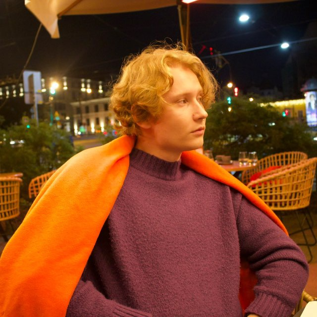

# About Me

**Product Manager / Product Analyst**  
Chelyabinsk → Saint Petersburg, Russia  

---

## Summary

I combine an engineering mindset with product thinking. I started as a **software engineer**, automating calculations and processes at industrial facilities. Later, I transitioned into **product analytics and management** — developing MVPs, segmenting audiences, and building hypotheses and metrics.  
Currently, I manage an e-commerce store and develop projects from scratch: from assortment and marketing to unit economics and strategy.

> My goal is to grow products where decisions are driven by data and hypotheses are tested quickly and clearly.

---

## Education

**Master’s Degree, ITMO University (2026)**  
Innovation and High-Tech Business Management  

**Bachelor’s Degree, South Ural State University (2023)**  
Infocommunication Technologies and Communication Systems  

---

## Skills

| Category        | Skills                                                                                         |
| :--------------- | :--------------------------------------------------------------------------------------------- |
| **Product**      | Customer Development, JTBD, MVP, A/B Testing, Unit Economics, P&L, Agile/Scrum, Kanban, Jira  |
| **Analytics**    | SQL, Excel, Python, Hypothesis Testing, Market Analysis, SWOT, Lean Canvas                    |
| **Technical**    | PHP, C/C++, Docker, API, DevOps, CJM                                                          |
| **Soft Skills**  | Critical Thinking, Structure, Systems Thinking, Responsibility                                |

---

## Certificates

* Samsung IoT (2023)

---

## Languages

* Russian — Native  
* English — B2 (Upper-Intermediate)

---

## Interests

* E-commerce, Bizdev
* Automation and product metrics  
* Judo